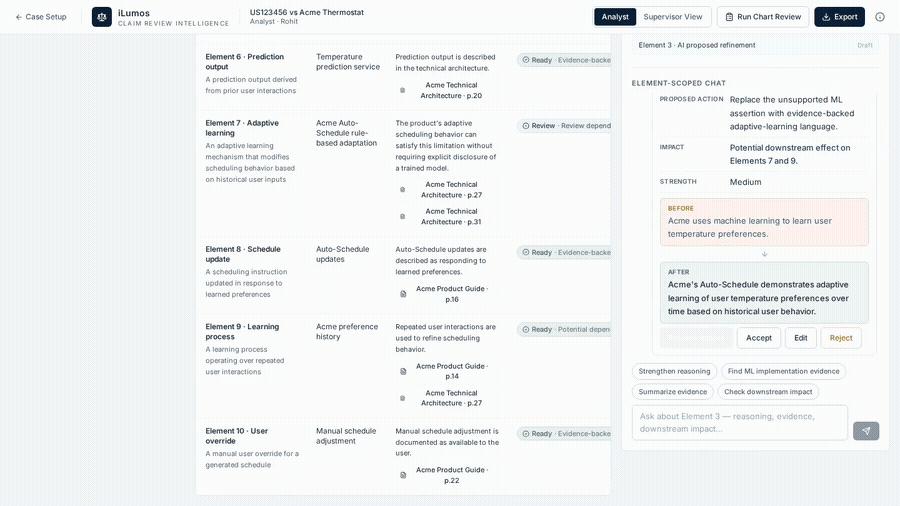

# iLumos — Claim Review Intelligence


A submission-ready prototype for the Lumenci PM take-home assignment.



> When the analyst changes one claim-chart decision, iLumos shows what else that decision might affect.

**Problem:** Element-level AI can accelerate claim-chart analysis, but material reasoning changes can have downstream implications across the chart.

**Differentiator:** Reasoning impact + chart-level review + supervisor provenance. When the analyst changes one claim-chart decision, iLumos shows what else that decision might affect.

**Demo case:** US123456 vs Acme Thermostat (entirely fictional; not legal evidence).

**Tech:** Frontend-only static prototype — React 19 + Tailwind, no backend, no API keys, no login. AI responses and document processing are deterministic simulated responses; the About dialog states this in-product.

**Prototype limitations:** No production document parsing, no real patent/prior-art search, no legal conclusions, no authentication, no backend. Uploaded files are local to the session.

## Run locally

```bash
cd frontend
yarn install
yarn start        # http://localhost:3000
```

## Build

```bash
cd frontend
yarn build        # outputs static site to frontend/build/
```

`homepage` is set to `./` and a `.nojekyll` file is included, so the build works from any subpath.

## Deploy to GitHub Pages

**Option A — GitHub Actions (recommended, zero local tooling):**
1. Push this repo to GitHub (`git remote add origin <your-repo> && git push -u origin main`).
2. Repo → Settings → Pages → Source: **GitHub Actions**.
3. The included `.github/workflows/pages.yml` builds `frontend/` and publishes on every push to `main`. The workflow run outputs the public URL.

**Option B — gh-pages package:**

```bash
cd frontend
yarn build
npx gh-pages -d build
```

**Option C — manual:** copy `frontend/build/*` to a `gh-pages` branch (or `/docs` on `main`) and enable Pages in repo settings.

No environment variables, server, or login required — the published URL opens straight into Case Setup.

## Golden-path demo

Setup → Use demo claim chart → Start analysis → Element 3 → Strengthen reasoning → send → Preview impact → Show affected decisions → Explain Element 7 → Apply change & review affected elements → Run Chart Review → Open comparison → Accept with rationale → 10/10 ready → Supervisor View → View reasoning replay → ← Case Setup → Continue analysis → Export.

## Walkthrough video

- `walkthrough/iLumos-walkthrough-narrated.mp4` (114 s) — AI-narrated voiceover (OpenAI tts-1-hd, onyx voice) timed to every action.
- `walkthrough/iLumos-walkthrough.mp4` (75 s) — silent fast cut.
- `walkthrough/WALKTHROUGH.md` — timestamped narration script.
- Regenerate: `python3 walkthrough/make_voice.py` then `python3 walkthrough/record_narrated.py` (requires `pip install playwright emergentintegrations`, `playwright install chromium`, ffmpeg).

## Keyboard shortcut

`Esc` jumps between the workspace and Case Setup (when no modal is open), closes the Chart Review overlay, and closes any open modal first.

## Export

Export generates a real binary `.docx` (Office Open XML) via the docx library, vendored at `frontend/public/vendor/docx.umd.js` and lazy-loaded only when exporting. Includes the final chart, evidence citations, decision history, and reviewer rationale.

